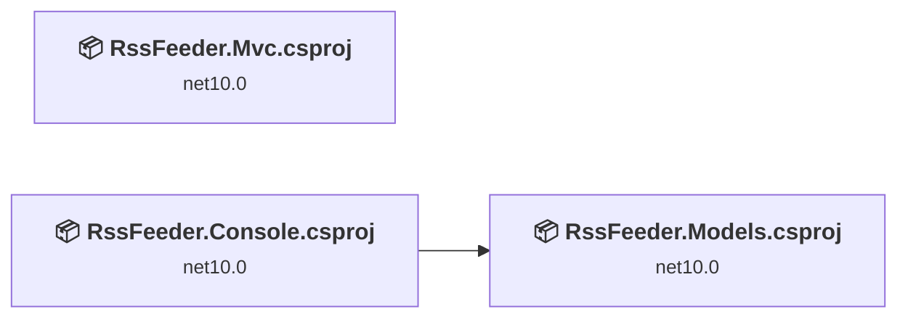
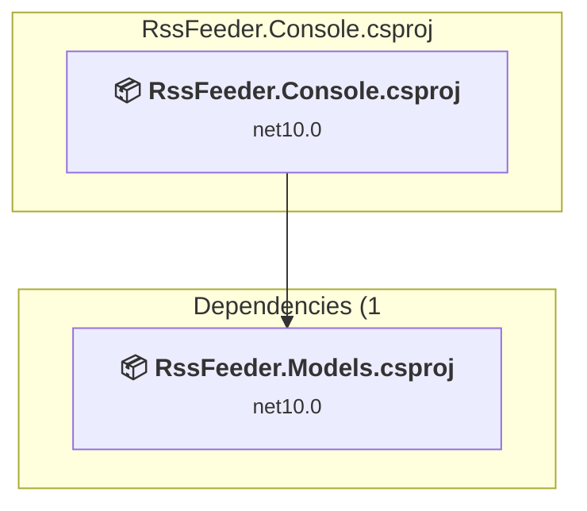
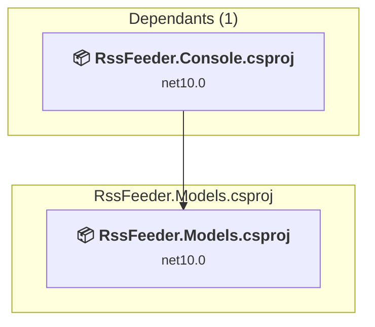
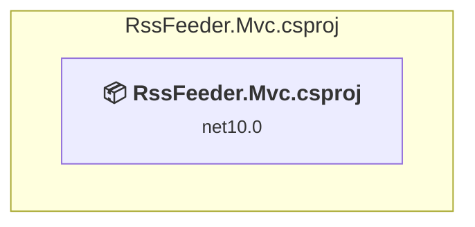

# Projects and dependencies analysis

This document provides a comprehensive overview of the projects and their dependencies in the context of upgrading to .NET 9.0.

## Table of Contents

- [Projects Relationship Graph](#projects-relationship-graph)
- [Project Details](#project-details)

  - [RssFeeder.Console\RssFeeder.Console.csproj](#rssfeederconsolerssfeederconsolecsproj)
  - [RssFeeder.Models\RssFeeder.Models.csproj](#rssfeedermodelsrssfeedermodelscsproj)
  - [RssFeeder.Mvc\RssFeeder.Mvc.csproj](#rssfeedermvcrssfeedermvccsproj)
- [Aggregate NuGet packages details](#aggregate-nuget-packages-details)

## Projects Relationship Graph

Legend:
📦 SDK-style project
⚙️ Classic project

## Project Details

### RssFeeder.Console\RssFeeder.Console.csproj

#### Project Info

- **Current Target Framework:** net10.0✅
- **SDK-style**: True
- **Project Kind:** DotNetCoreApp
- **Dependencies**: 1
- **Dependants**: 0
- **Number of Files**: 69
- **Lines of Code**: 5168

#### Dependency Graph

Legend:
📦 SDK-style project
⚙️ Classic project

#### Project Package References

| Package | Type | Current Version | Suggested Version | Description |
| :--- | :---: | :---: | :---: | :--- |
| AngleSharp | Explicit | 1.3.0 |  | ✅Compatible |
| Autofac.Extensions.DependencyInjection | Explicit | 10.0.0 |  | ✅Compatible |
| Domemtech.StringTemplate4 | Explicit | 4.3.0 |  | ✅Compatible |
| HtmlAgilityPack | Explicit | 1.12.4 |  | ✅Compatible |
| Microsoft.Azure.Cosmos | Explicit | 3.54.0 |  | ✅Compatible |
| Microsoft.Extensions.Configuration | Explicit | 9.0.10 |  | ✅Compatible |
| Microsoft.Extensions.Configuration.Binder | Explicit | 9.0.10 |  | ✅Compatible |
| Microsoft.Extensions.Configuration.EnvironmentVariables | Explicit | 9.0.10 |  | ✅Compatible |
| Microsoft.Extensions.Configuration.FileExtensions | Explicit | 9.0.10 |  | ✅Compatible |
| Microsoft.Extensions.Configuration.Json | Explicit | 9.0.10 |  | ✅Compatible |
| Microsoft.Extensions.Configuration.UserSecrets | Explicit | 9.0.10 |  | ✅Compatible |
| Microsoft.Extensions.FileProviders.Physical | Explicit | 9.0.10 |  | ✅Compatible |
| Microsoft.Extensions.Hosting.Abstractions | Explicit | 9.0.10 |  | ✅Compatible |
| Microsoft.Extensions.Options.ConfigurationExtensions | Explicit | 9.0.10 |  | ✅Compatible |
| Newtonsoft.Json | Explicit | 13.0.4 |  | ✅Compatible |
| Oakton | Explicit | 6.3.0 |  | ✅Compatible |
| RavenDB.Client | Explicit | 7.1.3 |  | ✅Compatible |
| RestSharp | Explicit | 112.1.0 |  | ✅Compatible |
| RulesEngine | Explicit | 6.0.0 |  | ✅Compatible |
| Selenium.Support | Explicit | 4.37.0 |  | ✅Compatible |
| Selenium.WebDriver | Explicit | 4.37.0 |  | ✅Compatible |
| Selenium.WebDriver.MicrosoftDriver | Explicit | 17.17134.0 |  | ✅Compatible |
| Serilog | Explicit | 4.3.0 |  | ✅Compatible |
| Serilog.Formatting.Compact | Explicit | 3.0.0 |  | ✅Compatible |
| Serilog.Settings.Configuration | Explicit | 9.0.0 |  | ✅Compatible |
| Serilog.Sinks.Console | Explicit | 6.0.0 |  | ✅Compatible |
| Serilog.Sinks.File | Explicit | 7.0.0 |  | ✅Compatible |
| Serilog.Sinks.Seq | Explicit | 9.0.0 |  | ✅Compatible |
| System.Linq.Dynamic.Core | Explicit | 1.6.9 |  | ✅Compatible |
| System.ServiceModel.Syndication | Explicit | 9.0.10 |  | ✅Compatible |

### RssFeeder.Models\RssFeeder.Models.csproj

#### Project Info

- **Current Target Framework:** net10.0✅
- **SDK-style**: True
- **Project Kind:** ClassLibrary
- **Dependencies**: 0
- **Dependants**: 1
- **Number of Files**: 6
- **Lines of Code**: 111

#### Dependency Graph

Legend:
📦 SDK-style project
⚙️ Classic project

#### Project Package References

| Package | Type | Current Version | Suggested Version | Description |
| :--- | :---: | :---: | :---: | :--- |
| Newtonsoft.Json | Explicit | 13.0.4 |  | ✅Compatible |

### RssFeeder.Mvc\RssFeeder.Mvc.csproj

#### Project Info

- **Current Target Framework:** net10.0✅
- **SDK-style**: True
- **Project Kind:** AspNetCore
- **Dependencies**: 0
- **Dependants**: 0
- **Number of Files**: 86
- **Lines of Code**: 1085

#### Dependency Graph

Legend:
📦 SDK-style project
⚙️ Classic project

#### Project Package References

| Package | Type | Current Version | Suggested Version | Description |
| :--- | :---: | :---: | :---: | :--- |
| Azure.Identity | Explicit | 1.17.0 |  | ✅Compatible |
| MediatR | Explicit | 12.5.0 |  | ✅Compatible |
| Microsoft.ApplicationInsights.AspNetCore | Explicit | 2.23.0 |  | ✅Compatible |
| Microsoft.Azure.Cosmos | Explicit | 3.54.0 |  | ✅Compatible |
| Microsoft.CodeAnalysis.CSharp.Workspaces | Explicit | 4.14.0 |  | ✅Compatible |
| Microsoft.Identity.Web | Explicit | 4.0.0 |  | ✅Compatible |
| Microsoft.Identity.Web.UI | Explicit | 4.0.0 |  | ✅Compatible |
| Microsoft.SyndicationFeed.ReaderWriter | Explicit | 1.0.2 |  | ✅Compatible |
| Newtonsoft.Json | Explicit | 13.0.4 |  | ✅Compatible |
| OwaspHeaders.Core | Explicit | 9.9.0 |  | ✅Compatible |
| Serilog.AspNetCore | Explicit | 9.0.0 |  | ✅Compatible |
| Serilog.Enrichers.Environment | Explicit | 3.0.1 |  | ✅Compatible |
| Serilog.Sinks.ApplicationInsights | Explicit | 4.0.0 |  | ✅Compatible |
| Serilog.Sinks.Console | Explicit | 6.0.0 |  | ✅Compatible |
| Serilog.Sinks.Seq | Explicit | 9.0.0 |  | ✅Compatible |
| System.Text.RegularExpressions | Explicit | 4.3.1 |  | ✅Compatible |
| ZiggyCreatures.FusionCache | Explicit | 2.4.0 |  | ✅Compatible |

## Aggregate NuGet packages details

| Package | Current Version | Suggested Version | Projects | Description |
| :--- | :---: | :---: | :--- | :--- |
| AngleSharp | 1.3.0 |  | [RssFeeder.Console.csproj](#rssfeederconsolecsproj) | ✅Compatible |
| Autofac.Extensions.DependencyInjection | 10.0.0 |  | [RssFeeder.Console.csproj](#rssfeederconsolecsproj) | ✅Compatible |
| Azure.Identity | 1.17.0 |  | [RssFeeder.Mvc.csproj](#rssfeedermvccsproj) | ✅Compatible |
| Domemtech.StringTemplate4 | 4.3.0 |  | [RssFeeder.Console.csproj](#rssfeederconsolecsproj) | ✅Compatible |
| HtmlAgilityPack | 1.12.4 |  | [RssFeeder.Console.csproj](#rssfeederconsolecsproj) | ✅Compatible |
| MediatR | 12.5.0 |  | [RssFeeder.Mvc.csproj](#rssfeedermvccsproj) | ✅Compatible |
| Microsoft.ApplicationInsights.AspNetCore | 2.23.0 |  | [RssFeeder.Mvc.csproj](#rssfeedermvccsproj) | ✅Compatible |
| Microsoft.Azure.Cosmos | 3.54.0 |  | [RssFeeder.Console.csproj](#rssfeederconsolecsproj) [RssFeeder.Mvc.csproj](#rssfeedermvccsproj) | ✅Compatible |
| Microsoft.CodeAnalysis.CSharp.Workspaces | 4.14.0 |  | [RssFeeder.Mvc.csproj](#rssfeedermvccsproj) | ✅Compatible |
| Microsoft.Extensions.Configuration | 9.0.10 |  | [RssFeeder.Console.csproj](#rssfeederconsolecsproj) | ✅Compatible |
| Microsoft.Extensions.Configuration.Binder | 9.0.10 |  | [RssFeeder.Console.csproj](#rssfeederconsolecsproj) | ✅Compatible |
| Microsoft.Extensions.Configuration.EnvironmentVariables | 9.0.10 |  | [RssFeeder.Console.csproj](#rssfeederconsolecsproj) | ✅Compatible |
| Microsoft.Extensions.Configuration.FileExtensions | 9.0.10 |  | [RssFeeder.Console.csproj](#rssfeederconsolecsproj) | ✅Compatible |
| Microsoft.Extensions.Configuration.Json | 9.0.10 |  | [RssFeeder.Console.csproj](#rssfeederconsolecsproj) | ✅Compatible |
| Microsoft.Extensions.Configuration.UserSecrets | 9.0.10 |  | [RssFeeder.Console.csproj](#rssfeederconsolecsproj) | ✅Compatible |
| Microsoft.Extensions.FileProviders.Physical | 9.0.10 |  | [RssFeeder.Console.csproj](#rssfeederconsolecsproj) | ✅Compatible |
| Microsoft.Extensions.Hosting.Abstractions | 9.0.10 |  | [RssFeeder.Console.csproj](#rssfeederconsolecsproj) | ✅Compatible |
| Microsoft.Extensions.Options.ConfigurationExtensions | 9.0.10 |  | [RssFeeder.Console.csproj](#rssfeederconsolecsproj) | ✅Compatible |
| Microsoft.Identity.Web | 4.0.0 |  | [RssFeeder.Mvc.csproj](#rssfeedermvccsproj) | ✅Compatible |
| Microsoft.Identity.Web.UI | 4.0.0 |  | [RssFeeder.Mvc.csproj](#rssfeedermvccsproj) | ✅Compatible |
| Microsoft.SyndicationFeed.ReaderWriter | 1.0.2 |  | [RssFeeder.Mvc.csproj](#rssfeedermvccsproj) | ✅Compatible |
| Newtonsoft.Json | 13.0.4 |  | [RssFeeder.Console.csproj](#rssfeederconsolecsproj) [RssFeeder.Models.csproj](#rssfeedermodelscsproj) [RssFeeder.Mvc.csproj](#rssfeedermvccsproj) | ✅Compatible |
| Oakton | 6.3.0 |  | [RssFeeder.Console.csproj](#rssfeederconsolecsproj) | ✅Compatible |
| OwaspHeaders.Core | 9.9.0 |  | [RssFeeder.Mvc.csproj](#rssfeedermvccsproj) | ✅Compatible |
| RavenDB.Client | 7.1.3 |  | [RssFeeder.Console.csproj](#rssfeederconsolecsproj) | ✅Compatible |
| RestSharp | 112.1.0 |  | [RssFeeder.Console.csproj](#rssfeederconsolecsproj) | ✅Compatible |
| RulesEngine | 6.0.0 |  | [RssFeeder.Console.csproj](#rssfeederconsolecsproj) | ✅Compatible |
| Selenium.Support | 4.37.0 |  | [RssFeeder.Console.csproj](#rssfeederconsolecsproj) | ✅Compatible |
| Selenium.WebDriver | 4.37.0 |  | [RssFeeder.Console.csproj](#rssfeederconsolecsproj) | ✅Compatible |
| Selenium.WebDriver.MicrosoftDriver | 17.17134.0 |  | [RssFeeder.Console.csproj](#rssfeederconsolecsproj) | ✅Compatible |
| Serilog | 4.3.0 |  | [RssFeeder.Console.csproj](#rssfeederconsolecsproj) | ✅Compatible |
| Serilog.AspNetCore | 9.0.0 |  | [RssFeeder.Mvc.csproj](#rssfeedermvccsproj) | ✅Compatible |
| Serilog.Enrichers.Environment | 3.0.1 |  | [RssFeeder.Mvc.csproj](#rssfeedermvccsproj) | ✅Compatible |
| Serilog.Formatting.Compact | 3.0.0 |  | [RssFeeder.Console.csproj](#rssfeederconsolecsproj) | ✅Compatible |
| Serilog.Settings.Configuration | 9.0.0 |  | [RssFeeder.Console.csproj](#rssfeederconsolecsproj) | ✅Compatible |
| Serilog.Sinks.ApplicationInsights | 4.0.0 |  | [RssFeeder.Mvc.csproj](#rssfeedermvccsproj) | ✅Compatible |
| Serilog.Sinks.Console | 6.0.0 |  | [RssFeeder.Console.csproj](#rssfeederconsolecsproj) [RssFeeder.Mvc.csproj](#rssfeedermvccsproj) | ✅Compatible |
| Serilog.Sinks.File | 7.0.0 |  | [RssFeeder.Console.csproj](#rssfeederconsolecsproj) | ✅Compatible |
| Serilog.Sinks.Seq | 9.0.0 |  | [RssFeeder.Console.csproj](#rssfeederconsolecsproj) [RssFeeder.Mvc.csproj](#rssfeedermvccsproj) | ✅Compatible |
| System.Linq.Dynamic.Core | 1.6.9 |  | [RssFeeder.Console.csproj](#rssfeederconsolecsproj) | ✅Compatible |
| System.ServiceModel.Syndication | 9.0.10 |  | [RssFeeder.Console.csproj](#rssfeederconsolecsproj) | ✅Compatible |
| System.Text.RegularExpressions | 4.3.1 |  | [RssFeeder.Mvc.csproj](#rssfeedermvccsproj) | ✅Compatible |
| ZiggyCreatures.FusionCache | 2.4.0 |  | [RssFeeder.Mvc.csproj](#rssfeedermvccsproj) | ✅Compatible |

